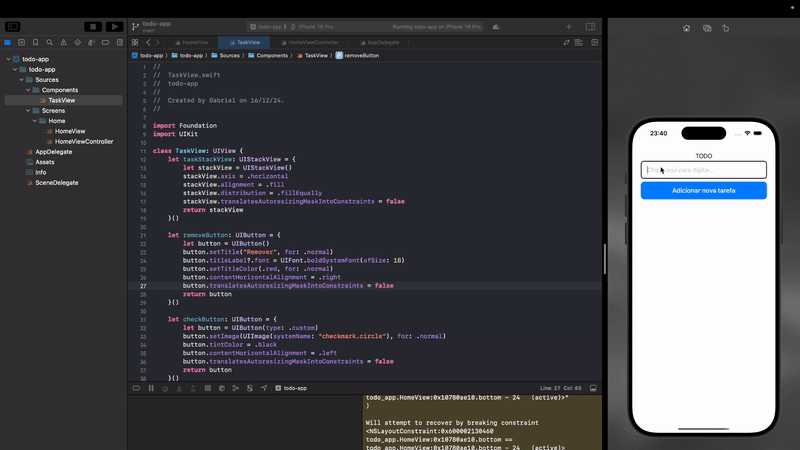

# todo-app-ios

## Sobre
Aplicativo feito com swift para a contrução de um app de lista de tarefas.

## 💻 Pré-requisitos

Antes de começar, verifique se você atendeu aos seguintes requisitos:

- Você instalou a versão mais recente de `<xcode>`
- Você tem uma máquina `<Mac>`. Indique qual sistema operacional é compatível / não compatível.

## 📫 Contribuindo para pertin

Para contribuir com pertin, siga estas etapas:

1. Bifurque este repositório.
2. Crie um branch: `git checkout -b <nome_branch>`.
3. Faça suas alterações e confirme-as: `git commit -m '<mensagem_commit>'`
4. Envie para o branch original: `git push origin <nome_do_projeto> / <local>`
5. Crie a solicitação de pull.

Como alternativa, consulte a documentação do GitHub em [como criar uma solicitação pull](https://help.github.com/en/github/collaborating-with-issues-and-pull-requests/creating-a-pull-request).

## 🤝 Colaboradores

<table>
  <tr>
    <td align="center">
      <a href="https://www.linkedin.com/in/gabriel-mendonca-pereira/" title="Linkedin">
         
        
          <b>Gabriel Mendonça Pereira</b>
        
      </a>
    </td>
  </tr>
</table>

## 📝 Licença

Esse projeto está sob licença. Veja o arquivo [LICENÇA](LICENSE.md) para mais detalhes.
